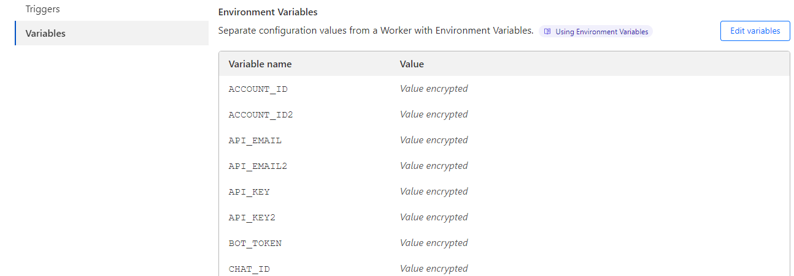
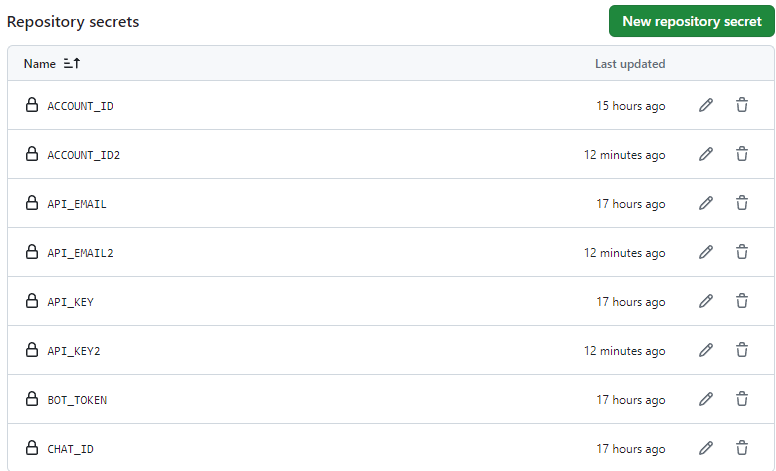

<div align="center">

# Cloudflare Worker Usage Monitor

**Theo dõi quota Cloudflare Workers (100k req/ngày) và cảnh báo qua Telegram — đa runtime: Cloudflare Workers, PHP, GitHub Actions.**

[](./LICENSE)
[](https://workers.cloudflare.com/)
[](https://www.php.net/)
[](./.github/workflows)
[](https://core.telegram.org/bots)
[](./CONTRIBUTING.md)

[🇻🇳 Tiếng Việt](#-tiếng-việt) · [🇺🇸 English](#-english) · [Quick Start](#-quick-start) · [Pitch](./PITCH.md)

[](https://deploy.workers.cloudflare.com/?url=https://github.com/captajn/Cloudflare-Worker-Usage)

</div>

---

## ✨ Features

- 🔎 **Truy vấn GraphQL Analytics API** của Cloudflare để lấy số request thực trong ngày.
- 📊 **Tính % sử dụng** so với quota 100k/ngày (free plan) — cảnh báo sớm trước khi sập.
- 🤖 **Push Telegram Bot** — realtime hoặc theo cron schedule.
- 👥 **Multi-account** — theo dõi nhiều tài khoản Cloudflare cùng lúc.
- 🚀 **3 runtime lựa chọn** — triển khai trên bất cứ đâu bạn có sẵn:
  - **Cloudflare Workers** (JS, serverless, 0đ).
  - **PHP 8.1+** (VPS / shared hosting).
  - **GitHub Actions** (cron schedule, 0đ, không cần server).
- 🔒 **Secret-safe** — không bao giờ echo credential ra HTML/log.
- 🌏 **Song ngữ Vi/En** — README + UI.

## 🏗 Architecture

```
┌─────────────────────┐         ┌──────────────────────────┐
│  Cloudflare Account │◄────────┤  Runtime (1 in 3)        │
│  GraphQL Analytics  │  query  │  ├─ Cloudflare Workers   │
│  API                │────────►│  ├─ PHP 8.1 + cURL       │
└─────────────────────┘         │  └─ GitHub Actions cron  │
                                └────────────┬─────────────┘
                                             │ format message
                                             ▼
                                  ┌──────────────────────┐
                                  │  Telegram Bot API    │
                                  │  sendMessage         │
                                  └──────────┬───────────┘
                                             ▼
                                      📱 Your device
```

## 📂 Project Structure

```
Cloudflare-Worker-Usage/
├── Json/                      # Cloudflare Workers runtime (JS)
│   ├── cloudflare.json        # Single account
│   └── multi-account.json     # Multi account
├── Php/                       # PHP runtime
│   ├── cloudflare.php
│   └── multi-account.php
├── .github/workflows/         # GitHub Actions cron runtime
│   ├── cloudflare-usage.yml
│   └── multi-account.yml
├── .env.example               # Template cho biến môi trường
├── wrangler.toml.example      # Template cho Wrangler CLI deploy
├── LICENSE                    # MIT
├── CONTRIBUTING.md
├── SECURITY.md
├── CHANGELOG.md
└── PITCH.md                   # Project pitch (funding)
```

---

## 🚀 Quick Start

### Bước 0 — Lấy credential Cloudflare + Telegram

| Biến         | Lấy ở đâu                                                                                                            |
| ------------ | -------------------------------------------------------------------------------------------------------------------- |
| `API_EMAIL`  | Email tài khoản Cloudflare                                                                                           |
| `API_KEY`    | [dash.cloudflare.com/profile/api-tokens](https://dash.cloudflare.com/profile/api-tokens) → **Global API Key** → View |
| `ACCOUNT_ID` | [dash.cloudflare.com](https://dash.cloudflare.com/) → copy từ URL (`/accounts/<ACCOUNT_ID>/...`)                     |
| `BOT_TOKEN`  | Tạo bot mới qua [@BotFather](https://t.me/BotFather) trên Telegram                                                   |
| `CHAT_ID`    | Nhắn cho bot 1 tin rồi gọi `https://api.telegram.org/bot<TOKEN>/getUpdates`                                          |

> 💡 Nếu dùng multi-account, thêm `API_EMAIL2`, `API_KEY2`, `ACCOUNT_ID2`.

### Option A — Cloudflare Workers (khuyên dùng, zero-cost)

```bash
# 1. Vào dash.cloudflare.com → Workers & Pages → Create → Worker
# 2. Copy nội dung Json/cloudflare.json (hoặc multi-account.json) paste vào editor
# 3. Settings → Variables and Secrets → thêm các biến ở Bước 0 (nhớ Encrypt)
# 4. Save and deploy → mở URL worker
```

Hoặc dùng nút 1-click:

[](https://deploy.workers.cloudflare.com/?url=https://github.com/captajn/Cloudflare-Worker-Usage)

### Option B — PHP

```bash
# Yêu cầu: PHP 8.1+ có ext-curl
cp .env.example .env
# Điền các biến vào .env, sau đó:
php -S 0.0.0.0:8080 Php/cloudflare.php
# Mở http://localhost:8080
```

Trên hosting/VPS: upload `Php/cloudflare.php` (hoặc `multi-account.php`), đặt biến env qua panel hoặc `.htaccess` → truy cập `https://yourdomain.com/cloudflare.php`.

### Option C — GitHub Actions (cron, không cần server)

```bash
# 1. Fork repo này
# 2. Settings → Secrets and variables → Actions → New repository secret
#    Thêm: API_EMAIL, API_KEY, ACCOUNT_ID, BOT_TOKEN, CHAT_ID
#    (multi-account: thêm API_EMAIL2, API_KEY2, ACCOUNT_ID2)
# 3. Actions → Enable workflows → Run hoặc đợi cron tự chạy
```

Schedule mặc định (giờ Việt Nam UTC+7): **12:00**, **18:00**, **22:00** hằng ngày. Sửa trong `.github/workflows/*.yml` nếu muốn khác.

---

## 📸 Screenshots

<div align="center">

| Setup biến Cloudflare                                    | GitHub Actions Secrets                       |
| -------------------------------------------------------- | -------------------------------------------- |
|  |  |

</div>

## 🗺 Roadmap

- [ ] Dashboard gộp tất cả tài khoản (Grafana/Cloudflare D1)
- [ ] Alert theo threshold (ví dụ >80% gửi cảnh báo)
- [ ] Discord / Slack webhook ngoài Telegram
- [ ] Theo dõi thêm: Workers KV, R2, D1 usage
- [ ] Bản Docker image cho self-host dễ hơn
- [ ] Unit test cho logic tính % + parser GraphQL response

## 🤝 Contributing

PR và Issue đều welcome! Xem [CONTRIBUTING.md](./CONTRIBUTING.md) cho hướng dẫn. Báo lỗ hổng bảo mật: xem [SECURITY.md](./SECURITY.md).

## 📜 License

Dự án phát hành dưới [MIT License](./LICENSE) — dùng tự do cho cá nhân và thương mại, giữ lại copyright notice.

---

## 🇻🇳 Tiếng Việt

### Mô tả

Dự án open-source giúp bạn **giám sát số request/ngày của Cloudflare Workers** (quota free 100k/ngày) và **gửi cảnh báo qua Telegram bot** — realtime hoặc theo lịch. Hỗ trợ 3 runtime (Workers / PHP / GitHub Actions), multi-account, hoàn toàn miễn phí nếu dùng Workers + Actions.

### Vì sao cần?

Cloudflare **không có cảnh báo usage tự động** cho free tier. Khi Worker của bạn hết 100k request, nó bị chặn thẳng — user bắt đầu gặp lỗi 1015/1027 mà bạn không biết. Dự án này giải quyết gap đó.

## 🇺🇸 English

### Description

Open-source tool to **monitor Cloudflare Workers daily request quota** (free-tier 100k/day) and **push alerts to Telegram** — realtime or scheduled. Ships with 3 runtimes (Workers / PHP / GitHub Actions), multi-account support, and $0 cost if you use Workers + Actions.

### Why?

Cloudflare **does not send usage alerts** on the free tier. When your Worker hits 100k requests, it silently starts rejecting traffic and users hit 1015/1027 errors before you notice. This project closes that gap.

### Setup (short)

1. Get `API_EMAIL`, `API_KEY` (Global), `ACCOUNT_ID` from [Cloudflare dashboard](https://dash.cloudflare.com/).
2. Create a Telegram bot via [@BotFather](https://t.me/BotFather) to get `BOT_TOKEN`, `CHAT_ID`.
3. Pick one runtime: Workers (copy `Json/*.json`), PHP (upload `Php/*.php`), or Actions (fork + add secrets).
4. Done — you'll receive daily usage reports in your Telegram.

See [Quick Start](#-quick-start) above for full instructions.

---

<div align="center">

Made with ☕ by [@captajn](https://github.com/captajn) · Star ⭐ the repo if it helped you

</div>
