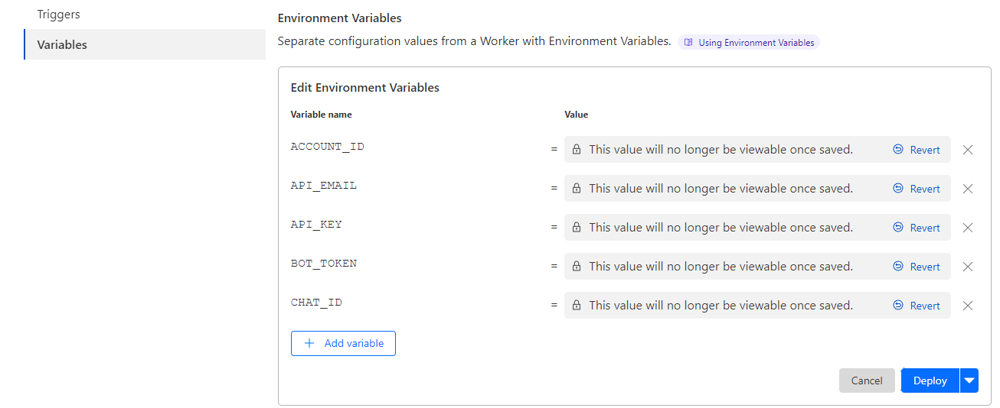

# Cloudflare Worker Usage

[English](#english) | [Tiếng Việt](#tiếng-việt)

## English

### Description
PHP/Json code allows you to query request volume/day from Cloudflare. By default, Cloudflare will give us 100k requests/day for all existing workers

### Create API Token, Setup Environment Variables
1. Access [Cloudflare API Tokens](https://dash.cloudflare.com/profile/api-tokens) to get Global API Key
2. Access [Cloudflare Dashboard](https://dash.cloudflare.com/) you will see ACCOUNT_ID on url browser
3. Access [Cloudflare Dashboard](https://dash.cloudflare.com/), select Worker & Pages, select Create Application > Create Worker (fill in your desired name) then press Deploy, you will get URL Worker to access later
4. On name Worker you created, click Settings - Variable - Environment Variables, create 5 variables named API_EMAIL, API_KEY, ACCOUNT_ID, BOT_TOKEN, CHAT_ID and fill in the Value column. Remember click button Encrypt
5. Variable và Encrypt

### With JSON
1. Copy the cloudflare.json file and paste to your Cloudflare Worker
2. Open the browser with Cloudflare's automatic worker url once you've set the name and Deloy is done

### With PHP
1. Install php 8.1+curl+Nginx on your vps if you don't have it yet. Hosting often support PHP, not need to install
2. [ACCOUNT_ID, API_KEY read Create API Token, Setup Environment Variables](#create-api-token-setup-environment-variables)
4. Modify the cloudflare.php information in the lines $api_email,$api_key,$account_id,$bot_token,$chat_id
5. Open your browser and access the file as ip/cloudflare.php or domain/cloudflare.php

### With Github Action
1. Fork this repo to your account
2. Enter your repository github - Settings - Secrets and variables - Action > Repository secrets
3. Create 5 Repository secrets: API_EMAIL, API_KEY, ACCOUNT_ID, BOT_TOKEN, CHAT_ID
4. Example

5. Run Github Action > Cloudflare API Usage

## Tiếng Việt

### Mô Tả
Code PHP/Json cho phép bạn truy vấn dung lượng request/ngày từ Cloudflare. Mặc định Cloudflare sẽ cho chúng ta 100k request/day đối với toàn bộ workers đang có.

### Tạo API Token, tạo các biến Environment Variables
1. Truy cập [Cloudflare API Tokens](https://dash.cloudflare.com/profile/api-tokens) để lấy Global API Key
2. Chú ý thanh trình duyệt [Cloudflare Dashboard](https://dash.cloudflare.com/) bạn sẽ thấy ACCOUNT_ID
3. Vào [Cloudflare Dashboard](https://dash.cloudflare.com/), chọn Worker & Pages, click Create Application > Create Worker(đặt tên tuỳ ý), sau đó ấn Deploy, url worker sẽ tự động tạo để truy cập
4. Chọn Worker đã tạo, vào mục Setting > Variable name tạo 5 biến tên API_EMAIL, API_KEY, ACCOUNT_ID, BOT_TOKEN, CHAT_ID và điền các giá trị vào. Nhớ click nút Encrypt(bảo mật)
5. Hình minh hoạ

### Đối với file PHP
1. Cài đặt php 8.1+curl+Nginx trên VPS nếu bạn chưa có. Hosting linux thường hỗ trợ sẵn php+webserver nên không cần cài.
2. Sửa đổi các thông tin trong file cloudflare.php các dòng $api_email,$api_key,$account_id,$bot_token,$chat_id
3. Mở trình duyệt của bạn và truy cập file theo dạng ip/cloudflare.php hoặc tên miền abc.com/cloudflare.php

### Đối với file json
1. Sao chép toàn bộ tập tin json và dán vào worker bạn vừa tạo ở trên
2. Mở trình duyệt bằng url worker của bạn và tận hưởng

### Chạy với Github Action
1. Fork repo này vào tài khoản của bạn
2. Vào repository của bạn Settings - Secrets and variables - Action > Repository secrets
3. Tạo 5 Repository secrets: API_EMAIL, API_KEY, ACCOUNT_ID, BOT_TOKEN, CHAT_ID
4. Hình minh hoạ

5. Chạy Github Action > Cloudflare API Usage và tận hưởng
